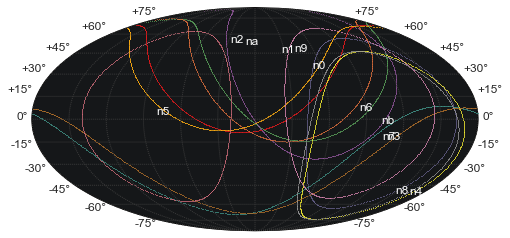
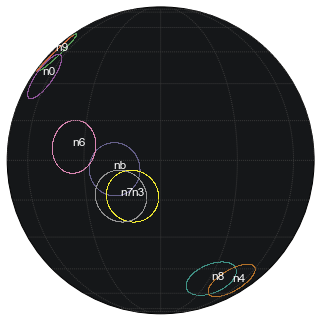
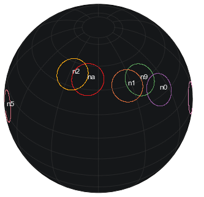
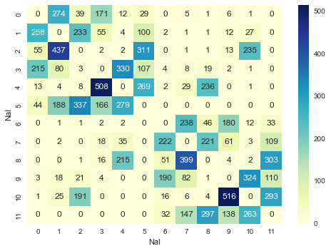

GBM Geometry Demo
=================

J. Michael Burgess

**gbmeometry** is a module with routines for handling GBM geometry. It
performs a few tasks: \* creates and astropy coordinate frame for Fermi
GBM given a quarternion \* allows for coordinate transforms from Fermi
frame to in astropy frame (J2000, etc.) \* plots the GBM NaI detectors
at a given time for a given FOV \* determines if a astropy SkyCoord
location is within an NaI's FOV \* creates interpolations over GBM
quarternions and SC coordinates

.. code:: python

    %pylab inline
    from astropy.coordinates import SkyCoord
    import astropy.units as u
    from gbmgeometry import *

.. parsed-literal::

    Populating the interactive namespace from numpy and matplotlib

Making an interpolation from TRIGDAT
------------------------------------

First let's create an interpolating object for a given TRIGDAT file
(POSHIST files are also readable)

.. code:: python

    interp = PositionInterpolator(trigdat="glg_trigdat_all_bn080916009_v02.fit")

.. code:: python

    # In trigger times
    print "Quarternions"
    print interp.quaternion(0)
    print interp.quaternion(10)
    print
    print "SC XYZ"
    print interp.sc_pos(0)
    print interp.sc_pos(10)
    
    
    

.. parsed-literal::

    Quarternions
    [ 0.09894184  0.81399423  0.56763536  0.07357984]
    [ 0.09651158  0.81315938  0.56970097  0.06998621]
    
    SC XYZ
    [ 3184.75  5985.5   1456.75]
    [ 3111.77432458  6015.91372132  1488.98009345]

Single detector
---------------

One can look at a single detector which knows about it's orientation in
the Fermi SC coordinates

.. code:: python

    na = NaIA(interp.quaternion(0))
    print na.get_center()
    print na.get_center().icrs #J2000
    print na.get_center().galactic # Galactic
    print 
    print "Changing in time"
    na.set_quaternion(interp.quaternion(100))
    print na.get_center()
    print na.get_center().icrs #J2000
    print na.get_center().galactic # Galactic

.. parsed-literal::

    <SkyCoord (GBMFrame: location=None): (Az, Zen) in deg
        (123.73, 0.42)>
    <SkyCoord (ICRS): (ra, dec) in deg
        (10.87454401, 51.46682152)>
    <SkyCoord (Galactic): (l, b) in deg
        (121.67070371, -11.38548177)>
    
    Changing in time
    <SkyCoord (GBMFrame: location=None): (Az, Zen) in deg
        (123.73, 0.42)>
    <SkyCoord (ICRS): (ra, dec) in deg
        (12.18669231, 50.71793413)>
    <SkyCoord (Galactic): (l, b) in deg
        (122.4962017, -12.15153667)>

Working with the GBM class
--------------------------

Ideally, we want to know about many detectors. The GBM class performs
operations on all detectors for ease of use. It also has plotting
capabilities

.. code:: python

    myGBM = GBM(interp.quaternion(0))
    
    myGBM.get_centers()
    

.. parsed-literal::

    [<SkyCoord (GBMFrame: location=None): (Az, Zen) in deg
         (123.73, 0.42)>, <SkyCoord (GBMFrame: location=None): (Az, Zen) in deg
         (183.74, 0.32)>, <SkyCoord (GBMFrame: location=None): (Az, Zen) in deg
         (236.61, -0.03)>, <SkyCoord (GBMFrame: location=None): (Az, Zen) in deg
         (135.19, -44.45)>, <SkyCoord (GBMFrame: location=None): (Az, Zen) in deg
         (45.89, -69.42)>, <SkyCoord (GBMFrame: location=None): (Az, Zen) in deg
         (45.11, -44.69)>, <SkyCoord (GBMFrame: location=None): (Az, Zen) in deg
         (58.44, 0.21)>, <SkyCoord (GBMFrame: location=None): (Az, Zen) in deg
         (314.87, -44.76)>, <SkyCoord (GBMFrame: location=None): (Az, Zen) in deg
         (303.15, 0.27)>, <SkyCoord (GBMFrame: location=None): (Az, Zen) in deg
         (3.35, -0.03)>, <SkyCoord (GBMFrame: location=None): (Az, Zen) in deg
         (224.93, -69.57)>, <SkyCoord (GBMFrame: location=None): (Az, Zen) in deg
         (224.62, -43.82)>]

.. code:: python

    [x.icrs for x in myGBM.get_centers()]

.. parsed-literal::

    [<SkyCoord (ICRS): (ra, dec) in deg
         (10.87454401, 51.46682152)>, <SkyCoord (ICRS): (ra, dec) in deg
         (257.94817938, -3.19344247)>, <SkyCoord (ICRS): (ra, dec) in deg
         (208.06855872, -51.20978742)>, <SkyCoord (ICRS): (ra, dec) in deg
         (320.48269649, 45.84400895)>, <SkyCoord (ICRS): (ra, dec) in deg
         (308.2800111, 33.90614974)>, <SkyCoord (ICRS): (ra, dec) in deg
         (333.95552134, 45.35546184)>, <SkyCoord (ICRS): (ra, dec) in deg
         (27.72590021, 52.62263506)>, <SkyCoord (ICRS): (ra, dec) in deg
         (251.23925919, -13.49416679)>, <SkyCoord (ICRS): (ra, dec) in deg
         (190.25871431, -52.33385762)>, <SkyCoord (ICRS): (ra, dec) in deg
         (79.7580822, 2.72733155)>, <SkyCoord (ICRS): (ra, dec) in deg
         (275.36551991, 5.3654963)>, <SkyCoord (ICRS): (ra, dec) in deg
         (255.86145056, -13.48403276)>]

Plotting
~~~~~~~~

We can look at the NaI view on the sky for a given FOV

.. code:: python

    myGBM.detector_plot(radius=60)

.. code:: python

    myGBM.detector_plot(radius=10,projection='ortho',lon_0=120)
    myGBM.detector_plot(radius=10,projection='ortho',lon_0=0,lat_0=40,fignum=2)

.. parsed-literal::

    Warning: Cannot label parallels on Orthographic basemapWarning: Cannot label parallels on Orthographic basemap

Capturing points on the sky
~~~~~~~~~~~~~~~~~~~~~~~~~~~

We can even see which detector's FOVs contain a point on the sky. We
create a mock GRB SKycoord first.

.. code:: python

    grb = SkyCoord(ra=130.,dec=-45 ,frame='icrs', unit='deg')
    
    
    myGBM.detector_plot(radius=60,
                        projection='ortho',
                        good=True, # only plot NaIs that see the GRB
                        point=grb,
                        lon_0=170,lat_0=-30)

.. parsed-literal::

    Warning: Cannot label parallels on Orthographic basemap

.. image:: demo_files/demo_14_1.png

We can even look at the separation angles for the detectors and the
source

.. code:: python

    seps = myGBM.get_separation(grb)
    
    seps.sort("Separation")
    
    seps

.. raw:: html

    &lt;Table length=12&gt;
    <table id="table4645562128" class="table-striped table-bordered table-condensed">
    <thead><tr><th>Detector</th><th>Separation</th></tr></thead>
    <thead><tr><th>str2</th><th>float64</th></tr></thead>
    <tr><td>n4</td><td>39.2778309457</td></tr>
    <tr><td>n8</td><td>50.0040573129</td></tr>
    <tr><td>n5</td><td>65.287209566</td></tr>
    <tr><td>n3</td><td>101.045607785</td></tr>
    <tr><td>n7</td><td>103.765260648</td></tr>
    <tr><td>nb</td><td>113.251509906</td></tr>
    <tr><td>n6</td><td>130.193801433</td></tr>
    <tr><td>n2</td><td>130.780347002</td></tr>
    <tr><td>na</td><td>140.133185652</td></tr>
    <tr><td>n1</td><td>163.172220711</td></tr>
    <tr><td>n0</td><td>168.827689813</td></tr>
    <tr><td>n9</td><td>172.59960907</td></tr>
    </table>

Examining Legal Detector Pairs
------------------------------

To see which detectors are valid, can look at the legal pairs map

.. code:: python

    get_legal_pairs()

